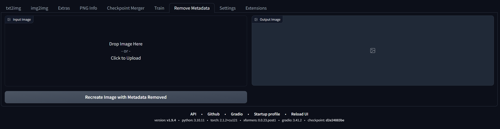

# stable-diffusion-webui-remove-metadata



Easy extension for removing images metadata.

## How to use


1. Clone this repo to `extensions` folder.
   - `https://github.com/tom-choi/stable-diffusion-webui-remove-metadata`
2. Restart webui.

## basic design
```
├── install.py (optional)
└── scripts
    ├── ${extension_name}.py
    ... (if extension need module division)
```

## Features

- Remove metadata from images.
- Support for multiple image formats.
- Support for multiple image sources.
- Support for multiple image outputs.